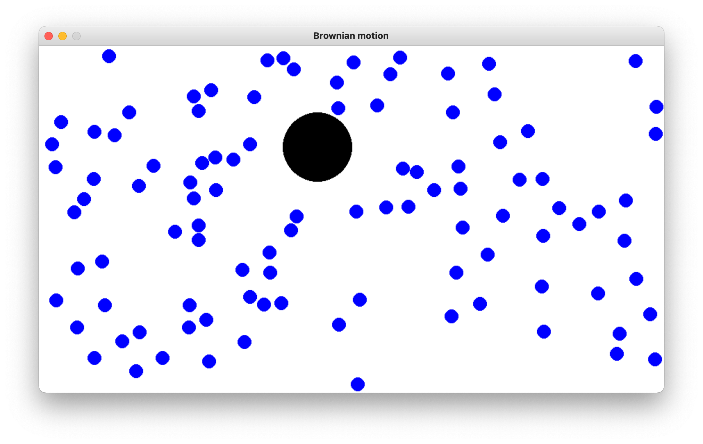

# Brownian-motion
We simulated the phenomena known as Brownian motion using a hard disc model for the simulation.



The program is written in Python and is dependent on the Pygame library which can be installed via pip3.

```
pip3 install pygame
```

To run the program type (from within the src folder)
```
python3 main.py
```

The code is inspired by:
https://algs4.cs.princeton.edu/61event/

**Matdoz and boenoob, March 2021**